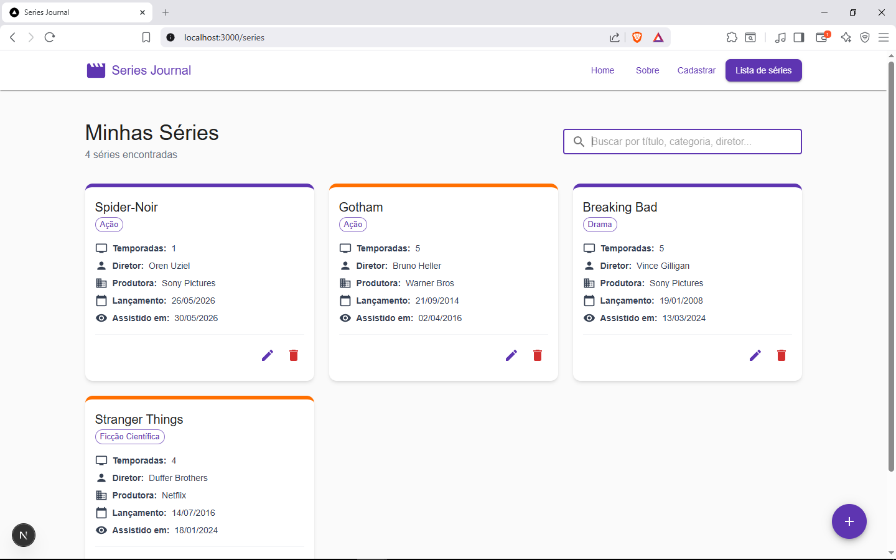
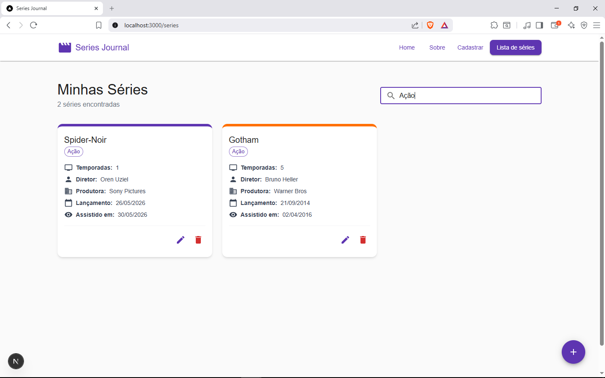

# Series Journal - Fase 2

**Aluno:** Wendell de Souza Dorta

**Disciplina:** Desenvolvimento de Sistemas Frontend

Este é um projeto de gerenciamento de séries assistidas desenvolvido com React (Next.js). A aplicação atende a todos os requisitos da Fase 2, integrando o frontend com uma API REST backend local via Axios e React Query para realizar todas as operações de CRUD dinâmico.

## 🛠️ Tecnologias Utilizadas
- **Framework:** Next.js (App Router)
- **UI:** Material-UI (MUI) & Tailwind CSS
- **Formulários & Validação:** React Hook Form + Zod
- **Feedbacks:** React Toastify
- **Qualidade de Código:** ESLint & Prettier

## ⚙️ Como executar o projeto

### 1. Executar a API Backend (`serieJournal-api`)
A aplicação consome dados de uma API REST local. Para iniciá-la:
1. Clone o repositório da API: `git clone https://github.com/adsPucrsOnline/DesenvolvimentoFrontend.git`
2. Entre na pasta correspondente: `cd ./DesenvolvimentoFrontend/serieJournal-api/`
3. Instale as dependências: `npm install`
4. Inicie o servidor da API (rodará em `http://localhost:5000`): `npm start`

### 2. Executar o Frontend (esta aplicação)
1. Extraia o arquivo `.zip` e abra a pasta do projeto em seu terminal.
2. Instale as dependências:
```bash
npm install
```
3. Execute o projeto localmente:
```bash
npm run dev
```
4. O projeto estará rodando em [http://localhost:3000](http://localhost:3000).

## 🧪 Testes

Foram implementados testes unitários de componentes utilizando **Jest** e **React Testing Library** para testar as principais estruturas da aplicação.

Para rodar todos os testes de componentes, execute no terminal do projeto frontend:
```bash
npm run test
```

## 🧩 Descrição dos Componentes Principais

- **NavBar:** Componente de layout localizado no topo de todas as páginas. Responsável por abrigar a logo da aplicação e os botões de navegação (Home, Sobre, Cadastrar e Lista). Utiliza o `usePathname` para destacar dinamicamente em qual rota o usuário está no momento.
- **SerieList:** Componente responsável por renderizar os *Cards* contendo as informações das séries assistidas e uma barra de busca dinâmica. Ele recebe a lista de séries via `props` e mapeia gerando o layout visual. Também emite o evento de exclusão e possui atalho para a edição de cada item.
- **SerieForm:** Componente de formulário altamente interativo. Utiliza o `zod` para validação em tempo real e o `react-hook-form` para controle de estado dos inputs sem perder performance. É um componente reutilizável, servindo tanto para criar novas séries quanto para editar as já existentes, integrando-se opcionalmente com o autocomplete do TVmaze.
- **Recommendations:** Componente inteligente que analisa as séries cadastradas no diário do usuário, considerando categoria, afinidade estilística (como Animes e Heróis) e avaliações por estrelas para sugerir novos títulos relevantes e de alta qualidade com imagens do TVmaze.
- **useSeries (Hook Customizado):** Controller que encapsula a lógica de negócios e as mutações CRUD. Ele se comunica com a API REST local utilizando `@tanstack/react-query` para gerenciamento de estado de dados, invalidação de caches e sincronização automática.
- **TtlCache (Camada de Cache):** Camada de caching com suporte a expiração (TTL) persistida no `localStorage` (com fallback em memória no servidor) para as buscas do TVmaze, garantindo retornos instantâneos (0ms) e reduzindo chamadas redundantes de rede.

## 📸 Imagens do Projeto

*(As imagens abaixo demonstram o funcionamento da interface)*







