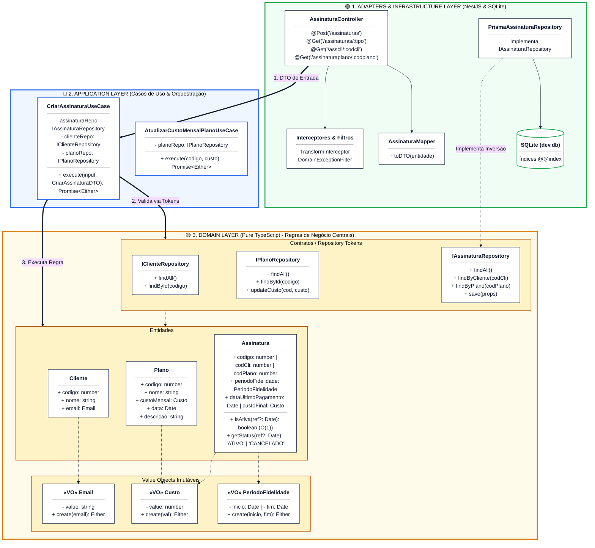

```mermaid
%%{init: {
  'theme': 'base',
  'themeVariables': {
    'fontSize': '17px',
    'fontFamily': 'Segoe UI, Arial, sans-serif',
    'primaryTextColor': '#0f172a',
    'lineColor': '#0f172a',
    'textColor': '#0f172a',
    'nodeSpacing': 30,
    'rankSpacing': 40
  }
}}%%
flowchart TD

    %% ==========================================
    %% 1. CAMADA EXTERNA: INFRAESTRUTURA & ADAPTERS
    %% ==========================================
    subgraph INFRA ["🟢 1. ADAPTERS & INFRASTRUCTURE LAYER (NestJS & SQLite)"]
        direction LR
        CTRL_ASS["<b>AssinaturaController</b><hr/>@Post('/assinaturas')<br/>@Get('/assinaturas/:tipo')<br/>@Get('/asscli/:codcli')<br/>@Get('/assinaturaplano/:codplano')"]
        MAPPER["<b>AssinaturaMapper</b><hr/>+ toDTO(entidade)"]
        FILTERS["<b>Interceptores & Filtros</b><hr/>TransformInterceptor<br/>DomainExceptionFilter"]
        PRISMA_REPO["<b>PrismaAssinaturaRepository</b><hr/>Implementa IAssinaturaRepository"]
        DB[("<b>SQLite (dev.db)</b><hr/>Índices @@index")]

        CTRL_ASS --> MAPPER
        CTRL_ASS --> FILTERS
        PRISMA_REPO --> DB
    end

    %% ==========================================
    %% 2. CAMADA INTERMEDIÁRIA: CASOS DE USO
    %% ==========================================
    subgraph APPLICATION ["🔵 2. APPLICATION LAYER (Casos de Uso & Orquestração)"]
        direction LR
        UC_CRIAR["<b>CriarAssinaturaUseCase</b><hr/>- assinaturaRepo: IAssinaturaRepository<br/>- clienteRepo: IClienteRepository<br/>- planoRepo: IPlanoRepository<hr/>+ execute(input: CriarAssinaturaDTO): Promise&lt;Either&gt;"]
        UC_ATUALIZAR["<b>AtualizarCustoMensalPlanoUseCase</b><hr/>- planoRepo: IPlanoRepository<hr/>+ execute(codigo, custo): Promise&lt;Either&gt;"]
    end

    %% ==========================================
    %% 3. CAMADA INTERNA: DOMÍNIO PURO
    %% ==========================================
    subgraph DOMAIN ["🟡 3. DOMAIN LAYER (Pure TypeScript - Regras de Negócio Centrais)"]
        direction TB

        subgraph INTERFACES ["Contratos / Repository Tokens"]
            direction LR
            REPO_CLI["<b>IClienteRepository</b><hr/>+ findAll()<br/>+ findById(codigo)"]
            REPO_PLANO["<b>IPlanoRepository</b><hr/>+ findAll()<br/>+ findById(codigo)<br/>+ updateCusto(cod, custo)"]
            REPO_ASS["<b>IAssinaturaRepository</b><hr/>+ findAll()<br/>+ findByCliente(codCli)<br/>+ findByPlano(codPlano)<br/>+ save(props)"]
        end

        subgraph ENTITIES ["Entidades"]
            direction LR
            ENT_CLIENTE["<b>Cliente</b><hr/>+ codigo: number<br/>+ nome: string<br/>+ email: Email"]
            ENT_PLANO["<b>Plano</b><hr/>+ codigo: number<br/>+ nome: string<br/>+ custoMensal: Custo<br/>+ data: Date<br/>+ descricao: string"]
            ENT_ASSINATURA["<b>Assinatura</b><hr/>+ codigo: number | codCli: number | codPlano: number<br/>+ periodoFidelidade: PeriodoFidelidade<br/>+ dataUltimoPagamento: Date | custoFinal: Custo<hr/>+ isAtiva(ref?: Date): boolean (O(1))<br/>+ getStatus(ref?: Date): 'ATIVO' | 'CANCELADO'"]
        end

        subgraph VOS ["Value Objects Imutáveis"]
            direction LR
            VO_EMAIL["<b>&laquo;VO&raquo; Email</b><hr/>- value: string<br/>+ create(email): Either"]
            VO_CUSTO["<b>&laquo;VO&raquo; Custo</b><hr/>- value: number<br/>+ create(val): Either"]
            VO_PERIODO["<b>&laquo;VO&raquo; PeriodoFidelidade</b><hr/>- inicio: Date | - fim: Date<br/>+ create(inicio, fim): Either"]
        end

        ENT_CLIENTE -.-> VO_EMAIL
        ENT_PLANO -.-> VO_CUSTO
        ENT_ASSINATURA -.-> VO_PERIODO
        ENT_ASSINATURA -.-> VO_CUSTO
        INTERFACES -.-> ENTITIES
    end

    %% ==========================================
    %% LIGAÇÕES ENTRE CAMADAS
    %% ==========================================
    CTRL_ASS ==>|1. DTO de Entrada| UC_CRIAR
    UC_CRIAR ==>|2. Valida via Tokens| INTERFACES
    UC_CRIAR ==>|3. Executa Regra| ENTITIES
    PRISMA_REPO -.->|Implementa Inversão| REPO_ASS

    %% ==========================================
    %% ESTILOS VISUAIS
    %% ==========================================
    style INFRA fill:#f0fdf4,stroke:#16a34a,stroke-width:3px
    style APPLICATION fill:#eff6ff,stroke:#2563eb,stroke-width:3px
    style DOMAIN fill:#fffbeb,stroke:#d97706,stroke-width:3px

    style INTERFACES fill:#fef3c7,stroke:#b45309,stroke-width:1.5px
    style ENTITIES fill:#fef3c7,stroke:#b45309,stroke-width:1.5px
    style VOS fill:#fef3c7,stroke:#b45309,stroke-width:1.5px

    style CTRL_ASS fill:#ffffff,stroke:#334155,stroke-width:1.5px,color:#0f172a
    style MAPPER fill:#ffffff,stroke:#334155,stroke-width:1.5px,color:#0f172a
    style FILTERS fill:#ffffff,stroke:#334155,stroke-width:1.5px,color:#0f172a
    style PRISMA_REPO fill:#ffffff,stroke:#334155,stroke-width:1.5px,color:#0f172a
    style DB fill:#ffffff,stroke:#16a34a,stroke-width:2px,color:#0f172a

    style UC_CRIAR fill:#ffffff,stroke:#2563eb,stroke-width:2px,color:#0f172a
    style UC_ATUALIZAR fill:#ffffff,stroke:#2563eb,stroke-width:2px,color:#0f172a

    style REPO_CLI fill:#ffffff,stroke:#334155,stroke-width:1.5px,color:#0f172a
    style REPO_PLANO fill:#ffffff,stroke:#334155,stroke-width:1.5px,color:#0f172a
    style REPO_ASS fill:#ffffff,stroke:#334155,stroke-width:1.5px,color:#0f172a

    style ENT_CLIENTE fill:#ffffff,stroke:#334155,stroke-width:1.5px,color:#0f172a
    style ENT_PLANO fill:#ffffff,stroke:#334155,stroke-width:1.5px,color:#0f172a
    style ENT_ASSINATURA fill:#ffffff,stroke:#334155,stroke-width:1.5px,color:#0f172a

    style VO_EMAIL fill:#ffffff,stroke:#334155,stroke-width:1.5px,color:#0f172a
    style VO_CUSTO fill:#ffffff,stroke:#334155,stroke-width:1.5px,color:#0f172a
    style VO_PERIODO fill:#ffffff,stroke:#334155,stroke-width:1.5px,color:#0f172a
```
